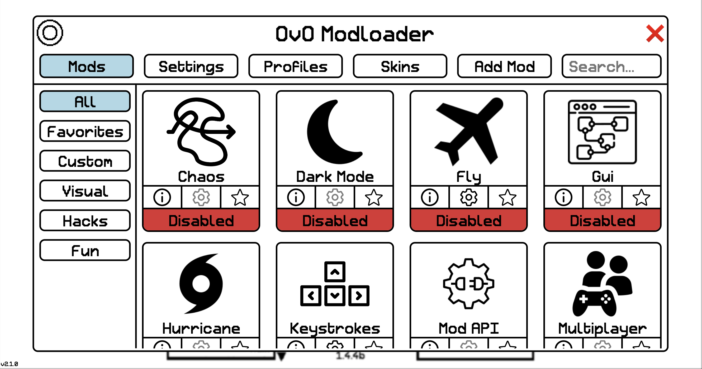

# OvO Modloader

A feature rich, gui integrated OvO mod menu.

## Features
- Enable, disable, add mods
- Customize mod settings
- Use community made skins
- Play community made levels
- Saves data across sessions & versions
- Supports 9+ versions

## To-do
- Settings

#
Ideas? Questions? Bug reports? Contact me via Discord at '.awesomeguy.'

 ## 
 Not affliated with [Dedra Games](https://dedragames.com/)

